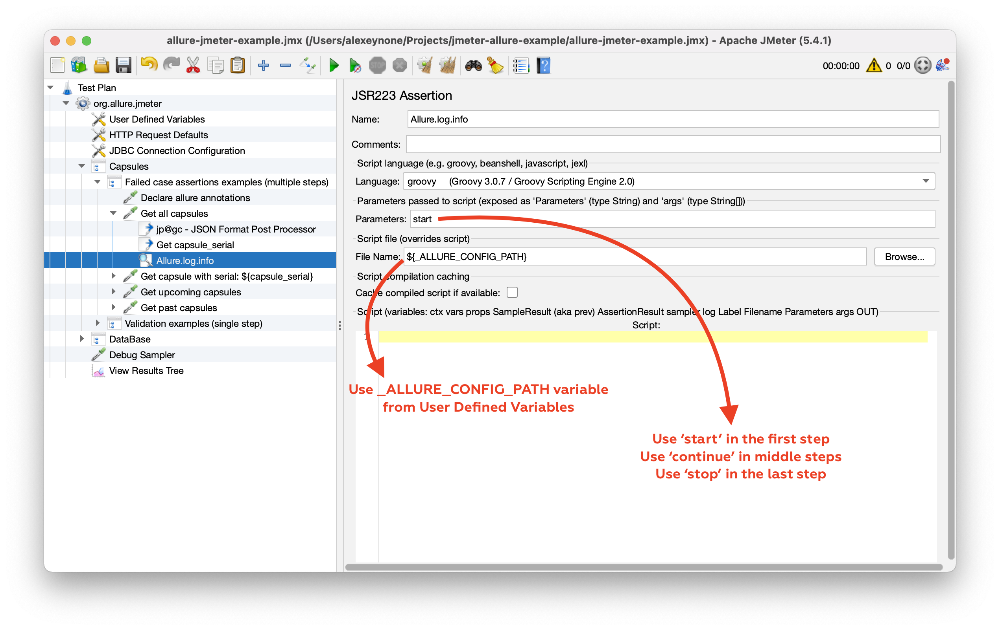

# JMeter Allure reporting
- Are you writing functional tests in JMeter?
- Is it difficult to understand what went wrong using standard means?
- Want to see detailed test reports?
- Do you need historicity?
- Need to keep test documentation?

This tutorial will help you create reports on JMeter tests in Allure Report format

NOT USABLE for load testing

##  Quick start via docker-compose
```bash
docker compose up && \
docker cp jmeter:/result/allure-results allure-results-example &&\
docker rm -f jmeter &&\
allure generate allure-results-example --clean -o allure-report
```
## Quick start via GUI-Mode
```bash
chmod +x installer.sh
./installer.sh
./apache-jmeter/bin/jmeter -t allure-jmeter-example.jmx 
```
Then you should change in User Defined Variables two variables to absolute path and click RUN

_ALLURE_REPORT_PATH: 
 - To run it via docker-compose just put '/result/allure-results'
 - To run local put here the absolute path to folder allure-results

_ALLURE_CONFIG_PATH: 
 - To run it via docker-compose just put allure-reporter.groovy (This file is already there in the root)
 - To run local put here the absolute path to file allure-reporter.groovy 

## How it works:
First, you need to initialize the parameters that are required to generate test results:


If the case consists of several steps, it should look like this:


Declare annotations before first step:


Declare parameters in JSR223 Assertion:


For example, if the case consists of one step a validation check looks like this:


Do not use parameters if case has one step:


Default report looks like this:


Allure Report looks like this:


## Works with the following Assertions:

| Assertion                         |
|--------------------               |
| Response Assertion                |
| JSON Assertion                    |
| Size Assertion                    |
| jp@gc - JSON/YAML Path Assertion  |

It should also work with the rest of default assertions.


## Troubleshooting:
- In test case with multiple steps if you forget to add one of the parameters in one of the steps, 
this step won't make it to the report and something will definitely go wrong, so be careful!
