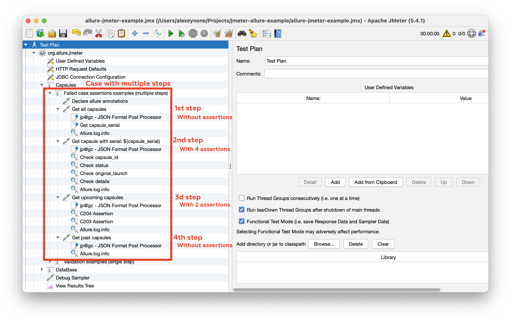
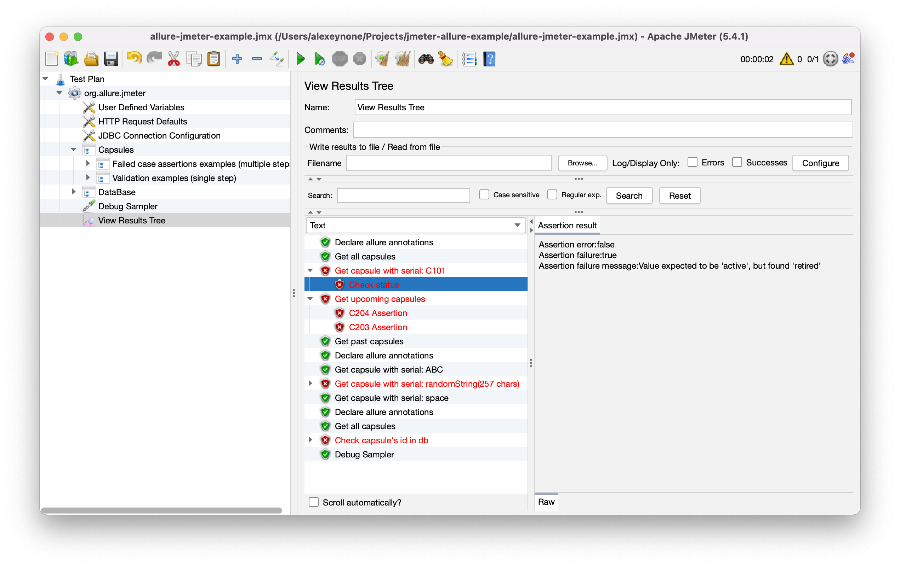
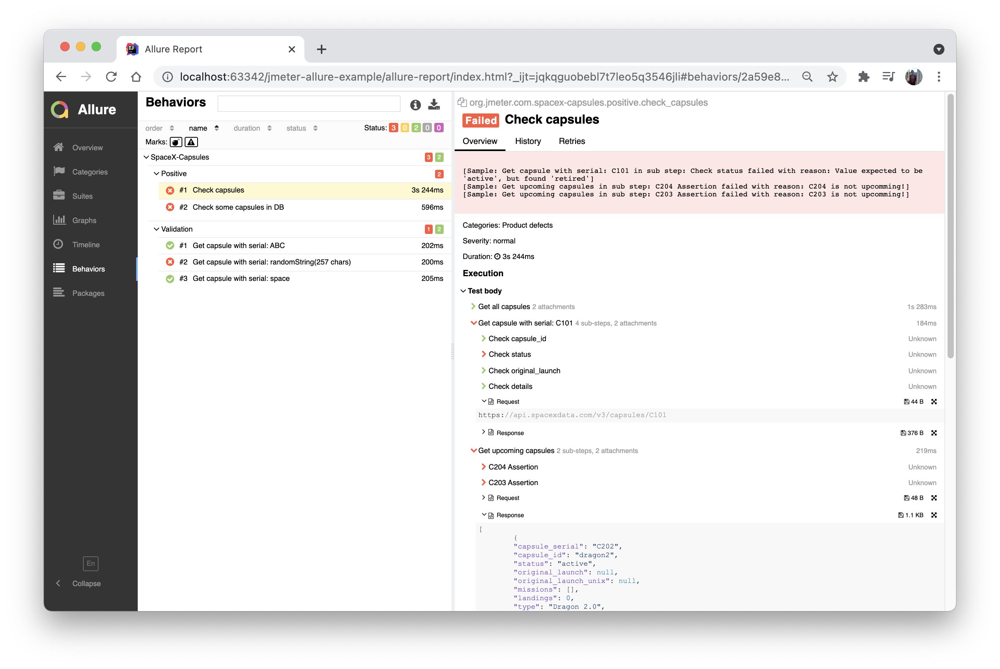
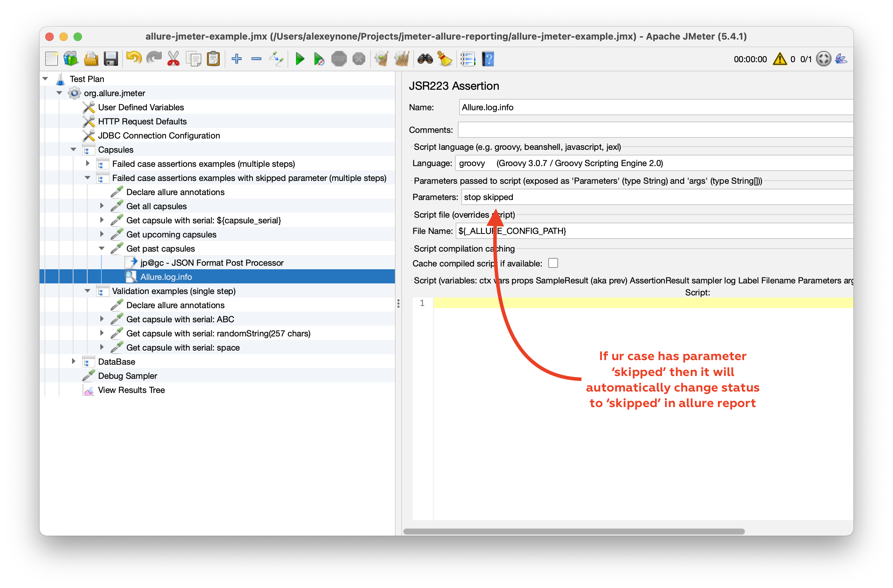
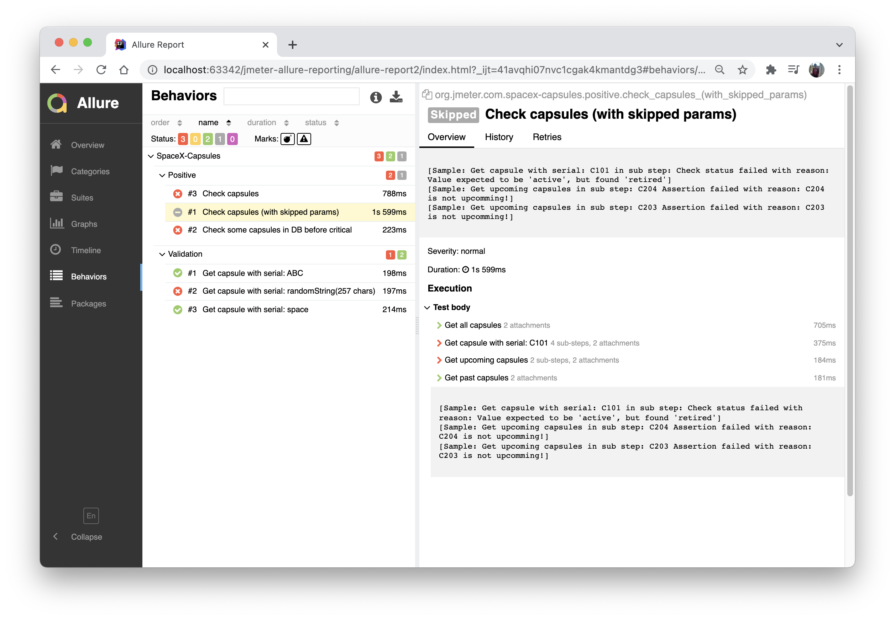
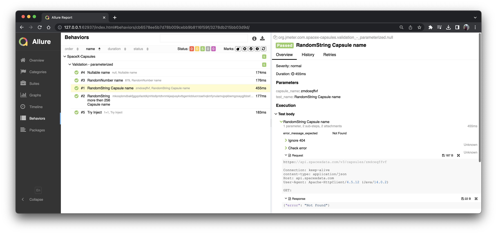
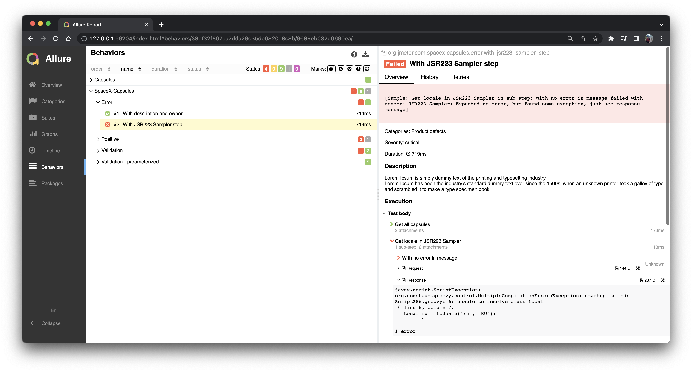
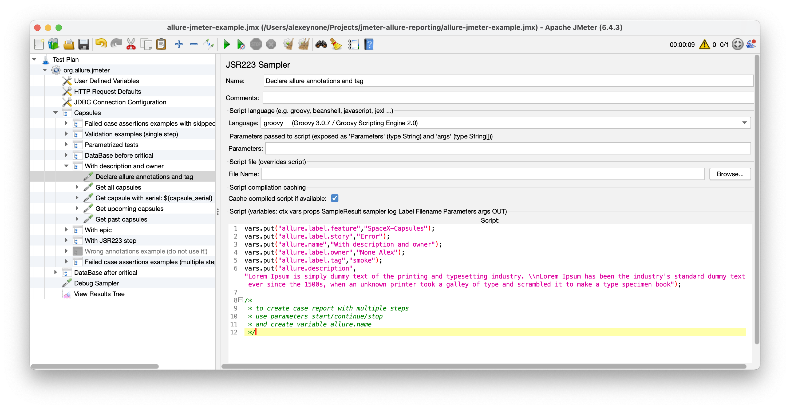
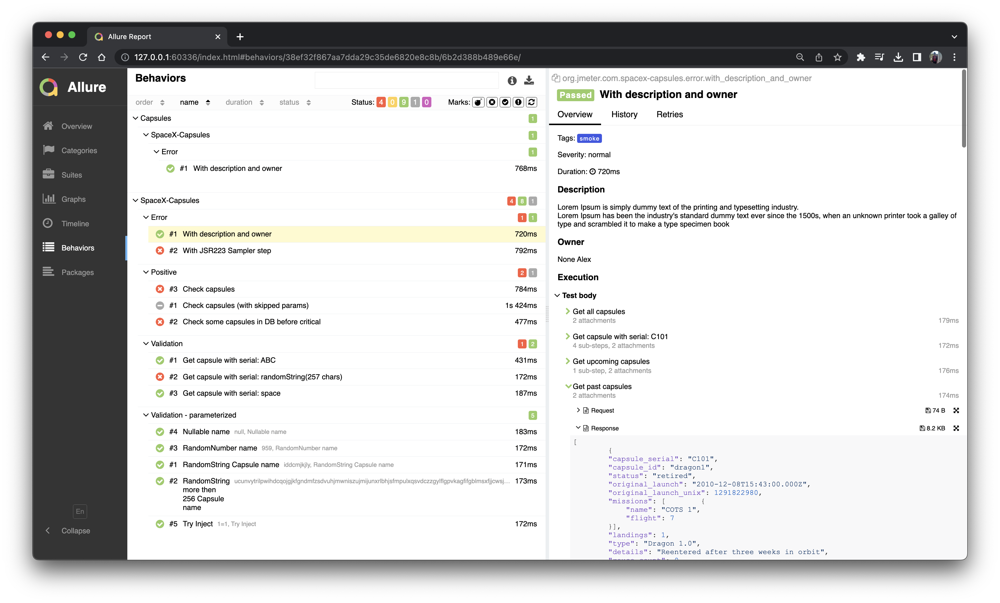

# JMeter Allure reporting 

[](https://github.com/nonealexq/jmeter-allure-reporting/stargazers)
[](https://github.com/nonealexq/jmeter-allure-reporting/watchers)
---
## Introduction
- Are you writing functional tests in JMeter?
- Is it difficult to understand what went wrong using standard means?
- Want to see detailed test reports?
- Do you need historicity?
- Need to keep test documentation?

This solutions will help you create reports on JMeter tests in Allure Report format

**NOT USABLE** for load testing

---

## Table of contents
- [Quick start via docker-compose](#quick-start-via-docker-compose)
- [Quick start via GUI-Mode](#quick-start-via-gui-mode)
- [Variables to generate report](#variables-to-generate-report)
- [How it works](#how-it-works)
- [Additional features](#additional-features)
- [Log details to console](#log-details-to-console)
---

##  Quick start via docker-compose
```bash
docker compose up && \
docker cp jmeter:/result/allure-results allure-results-example &&\
docker rm -f jmeter &&\
allure generate allure-results-example --clean -o allure-report
allure open allure-report/
```
---

## Quick start via GUI-Mode
```bash
chmod +x installer.sh
./installer.sh
./apache-jmeter/bin/jmeter -t allure-jmeter-example.jmx
allure generate allure-results/ --clean -o allure-report
allure open allure-report/
```

Then you should change in User Defined Variables two variables to absolute path and click RUN

#### _ALLURE_REPORT_PATH: 
 - To run it via docker-compose just put '/result/allure-results'
 - To run local put here the absolute path to folder allure-results

#### _ALLURE_CONFIG_PATH: 
 - To run it via docker-compose just put allure-reporter.groovy (This file is already there in the root)
 - To run local put here the absolute path to file allure-reporter.groovy

---

## How it works
First, you need to initialize the parameters that are required to generate test results:


If the case consists of several steps, it should look like this:


Declare annotations before first step:


Declare parameters in JSR223 Assertion:


For example, if the case consists of one step a validation check looks like this:


Do not use parameters if case has one step:


Default report looks like this:

- After running the script will create files in the folder allure-results for generating the report
, next just generate Allure Report with command:
```bash
allure generate allure-results --clean -o allure-report
```

Allure Report would look like this:



## Works with the following Assertions:

| Assertion                         |
|--------------------               |
| Response Assertion                |
| JSON Assertion                    |
| Size Assertion                    |
| jp@gc - JSON/YAML Path Assertion  |

It should also work with the rest of default assertions.

## Additional features
### Skipped annotations
If you would like to ignore case, just add 'skipped' to parameters near 'stop':



### Critical annotations
If you have critical main case to prepare data for next tests, you may use 'critical' parameters.
If this case fails - all next tests (thread group) will be stopped.


### Parameters annotations
Plugin Markdown Table Data-driven Controller allow to use parameterized tests. We can put our params to the report
1. Add Markdown Controller with params
   
2. Add variable to main annotations like
   ```bash
   vars.put("allure.parameters","[capsule_name,second_example_name_variable]")
   ```
   
3. Add parameter to sub annotations like
   ```bash
   parameters=[error_message_expected]
   
   // if step parameters more 1 - write with comma like
   // parameters=[variable1,variable2,error_message_expected]
   ```

   
4. Run, generate report
   

---

### Keep in report JSR223 Sampler
1. Just use JSR223 Sampler as simple step
2. Add sub annotation and asserts
3. Generate report
   

---

### Add description
You can add some description to your test with this variable 
   ```bash
  vars.put("allure.description","Lorem Ipsum is simply dummy text of the printing and typesetting industry. \\nLorem Ipsum has been the industry's standard dummy text ever since the 1500s, when an unknown printer took a galley of type and scrambled it to make a type specimen book");
   ```
---

### Add any custom label
If you want to add some custom label (for example severity/owner/tag) - you can do it!
   ```bash
  vars.put("allure.label.severity","critical");
  vars.put("allure.label.owner","None Alex");
  vars.put("allure.label.tag","smoke");
   ```
---
Look and feel with additional features:



---

## Log details to console
1. Logging of test passing time 
2. The number of tests passed is logged 
3. Information about passing the tests is logged with the corresponding status at the end of the line 
4. Logs critical failed tests at the WARN level
   
5. An error is logged if the start continue stop annotations are not correct
   

---

## Troubleshooting:
- In test case with multiple steps if you forget to add one of the parameters in one of the steps, 
this step won't make it to the report and something will definitely go wrong, so be careful!